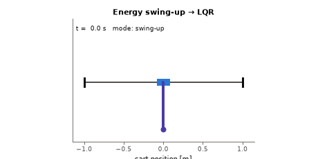

# Control Lab: Inverted Pendulum — resumen en español

[](https://github.com/julianS-eng/Control-lab-inverted-pendulum/actions/workflows/ci.yml)
[](LICENSE)
[](pyproject.toml)

Laboratorio de control de nivel profesional sobre un **péndulo invertido en carro**,
escrito en Python. La documentación completa (teoría, ecuaciones, todas las tablas y
figuras) está en el [README en inglés](README.md); la explicación didáctica paso a
paso, las decisiones de diseño y 10 preguntas de entrevista están en
[docs/LEARNING.md](docs/LEARNING.md).

<p align="center">
  
</p>

## Qué incluye

- **Modelo no lineal** obtenido con Lagrange (carro + varilla uniforme, fricción viscosa
  en carro y pivote) y **linealización** analítica verificada contra diferencias finitas.
- **Análisis estructural**: controlabilidad y observabilidad (rango de Kalman y test
  PBH). Con `x` y `θ` el sistema es observable; con solo `θ` no lo es (la posición del
  carro es invisible).
- **Controladores**: PID en cascada (anti-windup, derivada filtrada sobre la medición),
  asignación de polos, LQR con pesos justificados por la regla de Bryson y un barrido
  de `R`, LQG, LQG con compensación de retardo, y **swing-up por energía** que conmuta a
  LQR cerca de la vertical con histéresis y adaptación del objetivo de energía.
- **Estimación**: filtro de Kalman (LQG) y filtro de Kalman extendido (EKF) para el
  swing-up, a partir de mediciones ruidosas de posición y ángulo.
- **Implementación discreta**: `Ts = 10 ms`, retenedor de orden cero, saturación de
  ±10 N, retardo de una muestra, perturbaciones aleatorias.
- **Robustez**: márgenes de ganancia/fase/retardo exactos sobre el lazo discreto,
  **Monte Carlo** (500 plantas por nivel, tres niveles de incertidumbre en masa,
  longitud y fricción) y **región de atracción** empírica.
- **Métricas**: tiempo de asentamiento, sobreimpulso, *undershoot*, esfuerzo de control
  (∫u² dt, pico, RMS), tasa de éxito con intervalos de Wilson.
- Tests con pytest, ruff, mypy estricto y CI en GitHub Actions (Python 3.11–3.13).

## Resultados principales

Todas las cifras salen de ejecutar `pendulum-lab all` (ver tablas en el README).

| Controlador | Asentamiento escalón 0.5 m | Margen de retardo | Éxito Monte Carlo (extremo) |
|---|---:|---:|---:|
| PID en cascada | 2.47 s | 46.5 ms | 87.4 % |
| Asignación de polos + KF | 2.17 s | 53.3 ms | 92.0 % |
| LQG (LQR + KF) | 2.74 s | 33.2 ms | 93.2 % |
| LQG + compensación de retardo | 2.75 s | 40.2 ms | 95.8 % |

- **Swing-up** nominal: captura a los 4.07 s, estable a los 5.19 s, excursión máxima
  del carro 0.46 m. En Monte Carlo: 99.6 % (incertidumbre moderada), 89.8 % (severa).
- La **adaptación del objetivo de energía** sube el éxito del swing-up de 65.4 % a
  99.6 % con incertidumbre moderada.
- La **compensación de retardo** mantiene un 84 % de éxito con 50 ms de retardo en
  plantas con incertidumbre severa, frente al 30 % del LQG sin compensar.
- El **filtro de Kalman** estima la velocidad del carro con 25 mm/s de error RMS
  frente a 140 mm/s de las diferencias finitas.

## Uso rápido

```bash
python -m pip install -e ".[dev]"
pytest
pendulum-lab all          # regenera figuras, resultados y tablas del README
```

## Limitaciones conocidas

Solo simulación (sin banco físico); actuador ideal de fuerza; fricción solo viscosa;
márgenes calculados sobre el lazo linealizado; región de atracción empírica en un
corte 2-D; la adaptación del swing-up es heurística y baja al 67 % con incertidumbre
extrema. La lista completa y el trabajo futuro están en el
[README](README.md#known-limitations-and-future-work).

## Licencia

[MIT](LICENSE)
