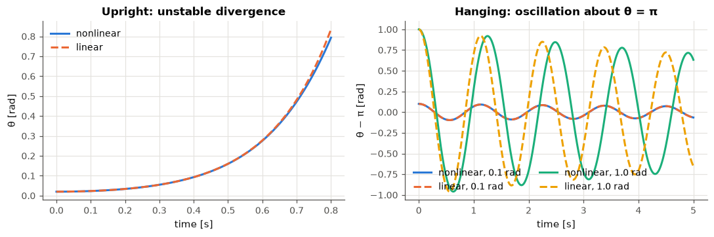
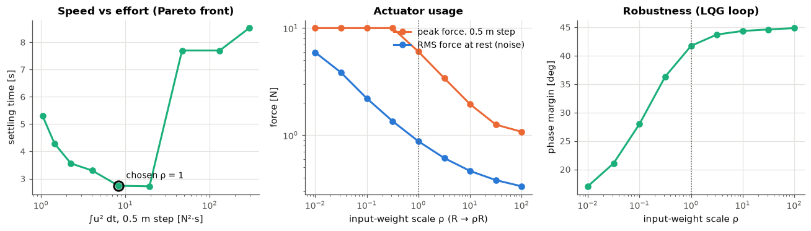
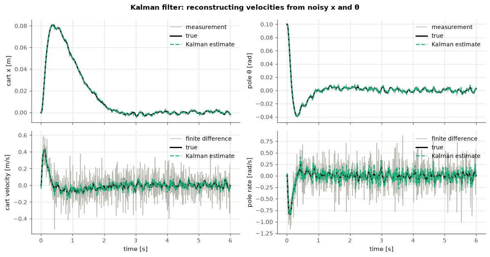
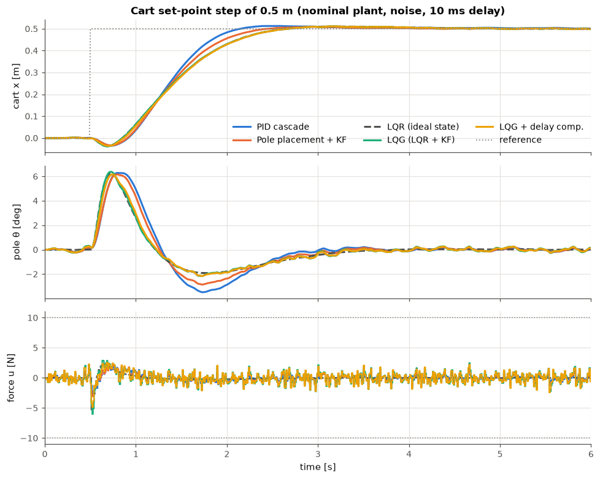
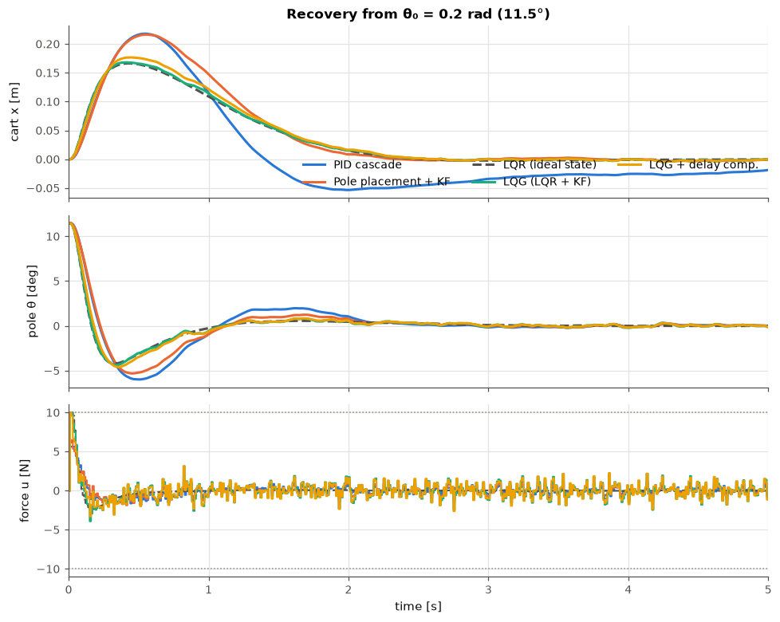
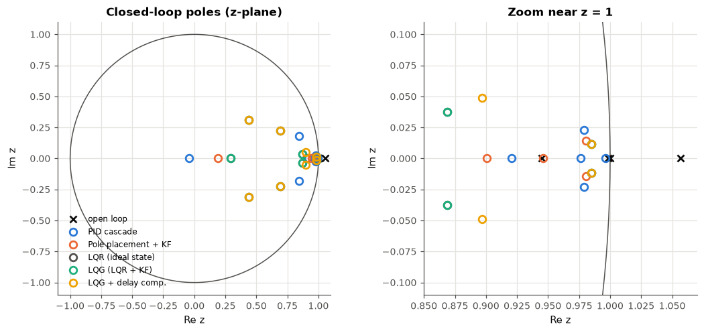
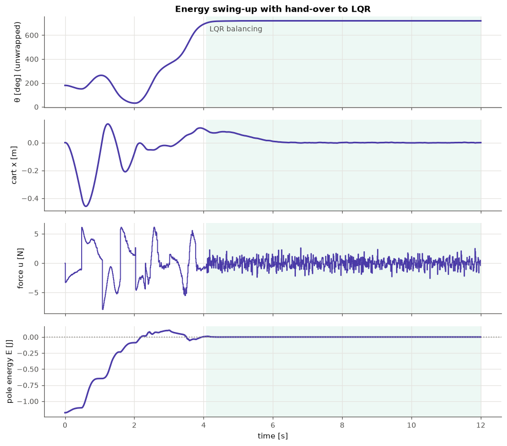
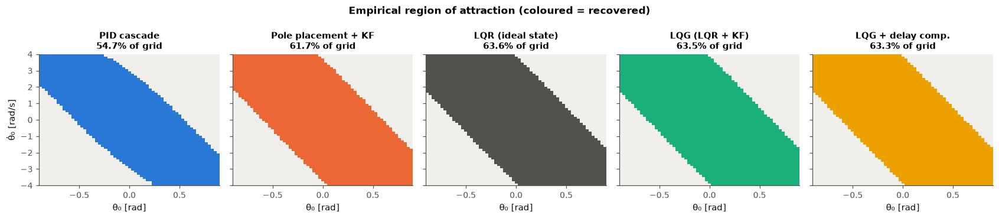
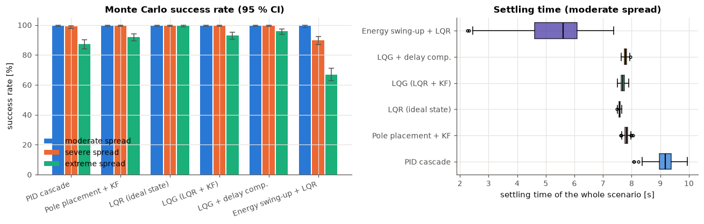
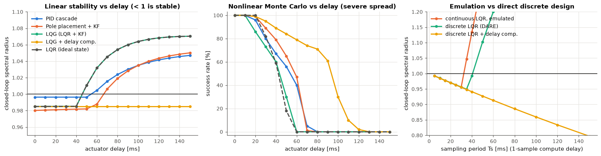

# Control Lab: Inverted Pendulum

[](https://github.com/julianS-eng/Control-lab-inverted-pendulum/actions/workflows/ci.yml)
[](LICENSE)
[](pyproject.toml)
[](pyproject.toml)
[](https://github.com/astral-sh/ruff)

A control-engineering laboratory for the **inverted pendulum on a cart**, built as an
engineering product rather than a homework script: a Lagrangian nonlinear model,
linear analysis, four families of controllers, Kalman/extended-Kalman estimation,
a discrete-time implementation with actuator saturation and delay, and robustness
studies (classical margins, Monte Carlo over plant parameters, region of attraction).

*Resumen en español: [README.es.md](README.es.md) · Guía de aprendizaje: [docs/LEARNING.md](docs/LEARNING.md)*

<p align="center">
  
</p>

> **Every number, table and figure in this README is produced by running the code.**
> Tables live between `<!-- BEGIN GENERATED -->` markers and are rewritten from
> [`docs/results/results.json`](docs/results/results.json) by `pendulum-lab all`
> (or `pendulum-lab report`). CI fails if the README drifts from the committed results.

---

## Contents

1. [Quick start](#quick-start)
2. [The plant](#the-plant)
3. [Modelling: Lagrange and linearisation](#modelling-lagrange-and-linearisation)
4. [Controllability and observability](#controllability-and-observability)
5. [Controllers](#controllers)
6. [State estimation (Kalman / LQG / EKF)](#state-estimation-kalman--lqg--ekf)
7. [Discrete-time implementation](#discrete-time-implementation)
8. [Results](#results)
9. [Lessons learned](#lessons-learned)
10. [Project layout](#project-layout)
11. [Known limitations and future work](#known-limitations-and-future-work)
12. [References](#references)

---

## Quick start

```bash
python -m pip install -e ".[dev]"      # Python 3.11+
pytest                                 # full test suite
pendulum-lab all                       # every study -> docs/img, docs/results, README tables
pendulum-lab all --quick --no-gif      # reduced sample sizes (smoke test, ~1.5 min)
pendulum-lab swingup                   # nominal swing-up figure + GIF only
pendulum-lab analyze                   # poles, controllability, observability (JSON)
```

Library use:

```python
import numpy as np
from pendulum_lab.params import LabConfig
from pendulum_lab.design import balance_strategies
from pendulum_lab.simulation import simulate, step_reference

cfg = LabConfig()                                   # 10 ms sampling, ±10 N, 1-sample delay
lqg = next(s for s in balance_strategies(cfg) if s.key == "lqg")
res = simulate(lqg.make_controller(), np.zeros(4), cfg, duration=8.0,
               estimator=lqg.make_estimator(), reference=step_reference(0.5, 0.5), seed=1)
print(res.x[-1, 0])                                 # final true state [x, x_dot, theta, theta_dot]
```

All stochastic experiments use fixed seeds (`DEFAULT_SEED = 20260928`), so re-running
reproduces the results bit-for-bit on the same NumPy/SciPy versions.

## The plant

<!-- BEGIN GENERATED: config -->
| Parameter | Value |
| :--- | ---: |
| Cart mass M | 0.5 kg |
| Pole mass m | 0.2 kg |
| Pivot to centre of mass l | 0.3 m (rod length 0.6 m) |
| Pole inertia about CoM J | 0.0060 kg·m² |
| Cart / pivot viscous friction | 0.1 N·s/m / 0.002 N·m·s/rad |
| Sampling period Ts | 10 ms (4 RK4 substeps) |
| Actuator | ±10.0 N, 1 sample(s) of delay |
| Sensor noise (1σ) | x: 1.0 mm, θ: 2.0 mrad |
| Random force disturbance (1σ) | 0.05 N |
| Rail half-length | 1.0 m |
<!-- END GENERATED: config -->

State `s = [x, ẋ, θ, θ̇]`; `θ` is measured **from the upright vertical**, positive when
the pole tip moves towards `+x`. The only input is the horizontal force `u` on the
cart. The sensors are a cart-position encoder and a pole-angle encoder, both with
additive Gaussian noise; velocities are never measured.

## Modelling: Lagrange and linearisation

With the pole centre of mass at `(x + l sin θ, l cos θ)`:

$$
T = \tfrac12 (M+m)\dot x^2 + m l \cos\theta\,\dot x\dot\theta + \tfrac12 (J + m l^2)\dot\theta^2,
\qquad V = m g l \cos\theta .
$$

The Euler–Lagrange equations with generalised forces $Q_x = u - b_c\dot x$ and
$Q_\theta = -b_p\dot\theta$ give

$$
\begin{bmatrix} M+m & m l\cos\theta \\ m l\cos\theta & J + m l^2 \end{bmatrix}
\begin{bmatrix} \ddot x \\ \ddot\theta \end{bmatrix}
=
\begin{bmatrix} u - b_c\dot x + m l \sin\theta\,\dot\theta^2 \\ m g l\sin\theta - b_p\dot\theta \end{bmatrix}.
$$

The mass matrix is always invertible: its determinant is at least $M m l^2 + (M+m)J > 0$.
Around $\theta = 0$, with $I = J + ml^2$ and $D = (M+m)I - (ml)^2$:

$$
A = \begin{bmatrix}
0 & 1 & 0 & 0 \\
0 & -\frac{I b_c}{D} & -\frac{(ml)^2 g}{D} & \frac{m l b_p}{D} \\
0 & 0 & 0 & 1 \\
0 & \frac{m l b_c}{D} & \frac{(M+m) m g l}{D} & -\frac{(M+m) b_p}{D}
\end{bmatrix},
\qquad
B = \begin{bmatrix} 0 \\ \frac{I}{D} \\ 0 \\ -\frac{ml}{D} \end{bmatrix}.
$$

The analytic Jacobians are unit-tested against central finite differences, and the
linear model is validated dynamically against the nonlinear one:

<!-- BEGIN GENERATED: linearization -->
| Check | Nonlinear | Linear |
| :--- | ---: | ---: |
| θ after 0.8 s from θ₀ = 0.02 rad (upright) [rad] | 0.7934 | 0.8352 |
| Hanging period, 0.1 rad swing [s] | 1.126 | 1.125 |
| Hanging period, 1.0 rad swing [s] | 1.221 | 1.125 |
| RK4 energy drift, 10 s frictionless [J] | 4.26e-11 | — |
<!-- END GENERATED: linearization -->



## Controllability and observability

<!-- BEGIN GENERATED: structure -->
| Quantity | Value |
| :--- | ---: |
| Open-loop poles [rad/s] | -5.660, -0.143, 0.000, 5.515 |
| Unstable pole (upright) | +5.515 rad/s |
| RHP zero of x/u | +4.952 rad/s |
| Controllability rank (continuous / discrete) | 4 / 4 (of 4) |
| Controllability matrix condition number | 134 |
| 1 s Gramian eigenvalues (min / max) | 3.31e-05 / 279 |

| Measured output | Observability rank | Condition number | Unobservable modes |
| :--- | ---: | ---: | ---: |
| x and theta | 4 / 4 | 33.8 | none |
| x only | 4 / 4 | 3.11 | none |
| theta only | 3 / 4 | inf | 0 |
<!-- END GENERATED: structure -->

* **Controllable** with a single force (Kalman rank test, confirmed by the PBH test,
  which reports no uncontrollable eigenvalue).
* **Observable from `x` and `θ`** — the sensor set used here — and, perhaps
  surprisingly, from `x` alone (the cart motion betrays the pole angle through the
  coupling), although with a worse-conditioned observability matrix.
* **Not observable from `θ` alone**: the PBH test isolates the unobservable mode at
  `s = 0`, the absolute cart position. An angle-only sensor lets the cart drift into
  the end stops unnoticed.
* The right-half-plane zero of `x/u` sits just below the unstable pole. The pole sets
  a *minimum* bandwidth for the angle loop; the zero sets a *maximum* bandwidth for
  the position loop and causes the initial *undershoot* seen in every step response.

## Controllers

| Controller | Information used | Design |
|---|---|---|
| **PID cascade** | raw `x`, `θ` measurements | inner angle PID + outer position PD, derivative on measurement with first-order filter, conditional-integration anti-windup, angle-reference clip |
| **Pole placement + KF** | Kalman estimate | discrete KNV placement of s-poles `−2 ± 1.5j` (ζ = 0.8, ωn = 2.5), `−5.5` (mirror of the unstable pole), `−8`, mapped by `z = e^{sTs}` |
| **LQR (ideal state)** | exact, noise-free state | *reference only* — not implementable, bounds what estimation costs |
| **LQG (LQR + KF)** | Kalman estimate | discrete LQR (DARE) with Bryson weights + current-estimator Kalman filter |
| **LQG + delay comp.** | Kalman estimate + commands in flight | LQR on the delay-augmented model `z = [x; u_{k−d}; …; u_{k−1}]` |
| **Energy swing-up + LQR** | EKF estimate | Åström–Furuta energy shaping, model-inverting force conversion, hysteretic switch to the delay-compensated LQR, per-swing energy-target adaptation |

### LQR weights: why this Q and R

Bryson's rule normalises each term of the cost by the square of its acceptable
excursion, which turns "choosing Q and R" into "choosing physical limits":
0.25 m of cart travel (a quarter of the rail half-length), 1 m/s cart speed,
0.1 rad of tilt (where `sin θ ≈ θ` to 0.2 %), 1.5 rad/s pole rate and 3 N of force
(under a third of saturation, leaving headroom for disturbance rejection).

<!-- BEGIN GENERATED: lqr -->
| Item | Value |
| :--- | ---: |
| Bryson limits (x, ẋ, θ, θ̇, u) | 0.25, 1.00, 0.10, 1.50, 3.00 |
| Q = diag(...) | 16, 1, 100, 0.444 |
| R | 0.1111 |
| K (u = −K x) | -10.63, -10.53, -53.80, -9.19 |
| Equivalent s-plane poles | -10.77+5.43j, -10.77-5.43j, -1.52+1.17j, -1.52-1.17j |
<!-- END GENERATED: lqr -->

The choice is then checked by sweeping the input weight `R → ρR` on the realistic
LQG loop (noise, delay, saturation):

<!-- BEGIN GENERATED: lqr_sweep -->
| ρ (R → ρR) | Settling [s] | ∫u² [N²s] | Peak \|u\| [N] | Noise RMS u [N] | PM [deg] | Lower GM [dB] |
| :--- | ---: | ---: | ---: | ---: | ---: | ---: |
| 0.01 | 8.52 | 293.6 | 10.0 | 5.938 | 17.0 | -21.4 |
| 0.0316228 | 7.70 | 131.6 | 10.0 | 3.846 | 21.1 | -19.1 |
| 0.1 | 7.70 | 47.0 | 10.0 | 2.205 | 28.0 | -16.4 |
| 0.316228 | 2.72 | 19.3 | 10.0 | 1.350 | 36.3 | -13.6 |
| 1 | 2.74 | 8.3 | 6.0 | 0.875 | 41.7 | -11.0 |
| 3.16228 | 3.30 | 4.0 | 3.4 | 0.611 | 43.7 | -8.8 |
| 10 | 3.56 | 2.3 | 1.9 | 0.463 | 44.4 | -7.3 |
| 31.6228 | 4.29 | 1.4 | 1.3 | 0.380 | 44.6 | -6.3 |
| 100 | 5.30 | 1.0 | 1.1 | 0.333 | 44.9 | -5.8 |
<!-- END GENERATED: lqr_sweep -->



### Swing-up

With the pole energy $E = \tfrac12 I\dot\theta^2 + m g l(\cos\theta - 1)$ (zero upright),
the pole equation gives $\dot E = -m l\cos\theta\,\dot\theta\,\ddot x - b_p\dot\theta^2$.
Commanding

$$
\ddot x = \operatorname{sat}_{a_{max}}\!\big(k_E (E - E_{ref})\,\operatorname{sign}(\dot\theta\cos\theta)\big) - k_x x - k_v \dot x
$$

makes the energy error decay monotonically; the acceleration is turned into a force
by inverting the nominal model (collocated partial feedback linearisation). The LQR
takes over when $|\theta| < 0.35$ rad **and** $|\dot\theta| < 2.5$ rad/s, and hands back
if $|\theta| > 0.9$ rad (hysteresis). Because the law regulates the energy *of the
nominal model*, a per-swing adaptation raises the energy target after a swing that
turns back short of the catch window and lowers it after a fly-over.

## State estimation (Kalman / LQG / EKF)

* **Process noise** is modelled physically — white force on the cart and torque on
  the pole — and discretised exactly with **Van Loan's method**.
* **Current-estimator form**: predict with the force actually applied (known, since
  the controller issued it through a deterministic delay line), correct with `y_k`,
  then compute `u_k` — no extra sample of delay.
* **Joseph-form** covariance update for numerical robustness.
* **EKF** for the swing-up: the upright linearisation has the wrong sign of gravity
  near `θ = π`. The EKF propagates the nonlinear model with RK4 and linearises the
  *discrete* map by central differences, vectorised over the whole batch.

<!-- BEGIN GENERATED: kalman -->
| State | Raw measurement RMS error | Finite-difference RMS error | Kalman RMS error |
| :--- | ---: | ---: | ---: |
| x [mm] | 1.01 | — | 0.69 |
| ẋ [mm/s] | — | 140.3 | 25.4 |
| θ [mrad] | 1.96 | — | 1.44 |
| θ̇ [mrad/s] | — | 287.6 | 82.8 |

Mean normalised innovation squared (NIS): **1.52** (expected 2.00 for a perfectly tuned filter with two measurements).
<!-- END GENERATED: kalman -->



<!-- BEGIN GENERATED: kalman_swingup -->
| Estimator in the swing-up loop | Swing-up succeeded | RMS θ error [rad] | RMS θ̇ error [rad/s] |
| :--- | ---: | ---: | ---: |
| linear KF | no | 0.030 | 3.988 |
| EKF | yes | 0.001 | 0.086 |
<!-- END GENERATED: kalman_swingup -->

## Discrete-time implementation

* Controllers run at a fixed `Ts = 10 ms`; the plant is integrated with 4 RK4
  substeps per period under a zero-order hold.
* Designs are **direct discrete** (DARE / placement on the exact ZOH model), not
  continuous designs emulated at the sample rate.
* One sample of **computation/transport delay**: the command computed at `t_k` acts
  on `[t_{k+1}, t_{k+2})`.
* **Saturation** at ±10 N, unknown **random force disturbance**, sensor **noise**, and
  optional encoder **quantisation**.
* The whole stack (plant, controllers, KF, EKF) is **batched**: `B` closed loops with
  different physical parameters run in lock-step, which makes a 500-plant Monte
  Carlo or a 3721-point region-of-attraction map take seconds in pure NumPy.

## Results

All results below use the nominal configuration above unless stated otherwise.

### Balancing: step and recovery

A 0.5 m cart set-point step at `t = 0.5 s` and a recovery from `θ₀ = 0.2 rad`, all
strategies sharing the same noise sequence. Settling requires the cart within 2 % of
the step (1 cm) **and** `|θ| ≤ 0.01 rad`; for the recovery, `|θ| ≤ 0.01 rad` and
`|x| ≤ 2 cm`. "At rest" columns are RMS values over the last 2 s of the recovery, i.e.
how much sensor noise leaks into the pole and the actuator.

<!-- BEGIN GENERATED: balance -->
| Controller | Step settling [s] | Overshoot [%] | Undershoot [%] | ∫u² step [N²s] | Peak \|u\| [N] | Recovery settling [s] | Peak cart [m] | RMS θ at rest [mrad] | RMS u at rest [N] |
| :--- | ---: | ---: | ---: | ---: | ---: | ---: | ---: | ---: | ---: |
| PID cascade | 2.47 | 2.6 | 7.0 | 2.6 | 2.7 | 4.96 | 0.22 | 1.85 | 0.429 |
| Pole placement + KF | 2.17 | 1.8 | 6.8 | 3.4 | 3.1 | 2.04 | 0.22 | 1.90 | 0.543 |
| LQR (ideal state) | 2.87 | 2.1 | 7.4 | 1.7 | 5.3 | 1.90 | 0.17 | 0.24 | 0.022 |
| LQG (LQR + KF) | 2.74 | 2.3 | 7.6 | 8.3 | 6.0 | 2.00 | 0.17 | 2.26 | 0.898 |
| LQG + delay comp. | 2.75 | 2.3 | 7.2 | 7.7 | 4.9 | 2.00 | 0.18 | 2.07 | 0.879 |
<!-- END GENERATED: balance -->




### Classical margins (linear loop, broken at the actuator)

Computed exactly on the discrete loop that is simulated (including the delay line
and, for LQG, the observer dynamics): the gain interval from closed-loop eigenvalues
plus bisection, the phase margin at every `|L| = 1` crossing, and the delay margin
both from `PM/ωc` and exactly in whole samples.

<!-- BEGIN GENERATED: margins -->
| Loop (broken at the actuator) | Gain margin ↓ [dB] | Gain margin ↑ [dB] | Phase margin [deg] | Crossover [rad/s] | Delay margin [ms] | Extra samples tolerated |
| :--- | ---: | ---: | ---: | ---: | ---: | ---: |
| PID cascade | -5.9 | 10.7 | 39.4 | 14.8 | 46.5 | 4 |
| Pole placement + KF | -7.1 | 10.6 | 45.1 | 14.8 | 53.3 | 5 |
| LQR (ideal state) | -11.6 | 12.5 | 47.0 | 22.5 | 36.4 | 3 |
| LQG (LQR + KF) | -11.0 | 8.0 | 41.7 | 21.9 | 33.2 | 3 |
| LQG + delay comp. | -10.0 | 9.3 | 44.5 | 19.3 | 40.2 | 4 |
<!-- END GENERATED: margins -->



### Swing-up

<!-- BEGIN GENERATED: swingup -->
| Metric | Value |
| :--- | ---: |
| Hand-over to LQR (catch time) | 4.07 s |
| Settled upright (\|θ\| < 0.05 rad, \|x\| < 5 cm) | 5.19 s |
| Peak cart excursion | 0.46 m |
| Peak force | 7.9 N |
| Control energy ∫u² dt | 45.7 N²s |
| Mode switches | 1 |
| GIF size | 0.51 MB |
<!-- END GENERATED: swingup -->



### Region of attraction

Empirical basin on the `(θ₀, θ̇₀)` plane with saturation, delay and noise (cart at rest
at the origin; estimator started at the true state to isolate the loop's own basin).
Success = balanced and centred over the last second, never past horizontal, never off
the rail.

<!-- BEGIN GENERATED: roa -->
| Controller | Recovered fraction of grid | Area [rad²/s] | Largest recoverable θ₀ at rest [deg] |
| :--- | ---: | ---: | ---: |
| PID cascade | 54.7 % | 8.15 | 30.9 |
| Pole placement + KF | 61.7 % | 9.18 | 34.4 |
| LQR (ideal state) | 63.6 % | 9.46 | 36.1 |
| LQG (LQR + KF) | 63.5 % | 9.45 | 36.1 |
| LQG + delay comp. | 63.3 % | 9.43 | 34.4 |
<!-- END GENERATED: roa -->



### Monte Carlo robustness

Each balancing controller runs the same acceptance scenario on the same sampled
plants: random initial tilt up to 0.25 rad and rate up to 0.5 rad/s, a 0.4 m cart
step at 2 s, and an 8 N × 0.1 s push at 6 s. The swing-up starts hanging
(± 0.1 rad) and must be balanced and centred at 15 s. Parameters are drawn per level:

<!-- BEGIN GENERATED: uncertainty -->
| Level | Cart mass M | Pole mass m | Length l | Friction b_c, b_p |
| :--- | ---: | ---: | ---: | ---: |
| moderate | ±20 % | ±20 % | ±20 % | ×/÷ 2 |
| severe | ±40 % | ±50 % | ±40 % | ×/÷ 4 |
| extreme | ±60 % | ±70 % | ±60 % | ×/÷ 8 |
<!-- END GENERATED: uncertainty -->

<!-- BEGIN GENERATED: monte_carlo -->
| Controller | Success, moderate | Success, severe | Success, extreme | Median settling, moderate [s] | Median ∫u², moderate [N²s] |
| :--- | ---: | ---: | ---: | ---: | ---: |
| PID cascade | 100.0 % [99.2, 100.0] | 99.0 % [97.7, 99.6] | 87.4 % [84.2, 90.0] | 9.17 | 14.9 |
| Pole placement + KF | 100.0 % [99.2, 100.0] | 100.0 % [99.2, 100.0] | 92.0 % [89.3, 94.1] | 7.82 | 14.2 |
| LQR (ideal state) | 100.0 % [99.2, 100.0] | 100.0 % [99.2, 100.0] | 99.8 % [98.9, 100.0] | 7.58 | 12.6 |
| LQG (LQR + KF) | 100.0 % [99.2, 100.0] | 100.0 % [99.2, 100.0] | 93.2 % [90.6, 95.1] | 7.69 | 21.5 |
| LQG + delay comp. | 100.0 % [99.2, 100.0] | 100.0 % [99.2, 100.0] | 95.8 % [93.7, 97.2] | 7.78 | 19.9 |
| Energy swing-up + LQR | 99.6 % [98.6, 99.9] | 89.8 % [86.8, 92.2] | 67.0 % [62.8, 71.0] | 5.61 | 53.3 |

*n = 500 sampled plants per level (common random numbers across controllers); brackets are Wilson 95 % confidence intervals.*
<!-- END GENERATED: monte_carlo -->



**Swing-up ablation** — same plants, three variants of the energy-target logic:

<!-- BEGIN GENERATED: swingup_ablation -->
| Swing-up variant | Success, moderate | Success, severe | Success, extreme |
| :--- | ---: | ---: | ---: |
| no adaptation | 65.4 % [61.1, 69.4] | 39.4 % [35.2, 43.7] | 36.8 % [32.7, 41.1] |
| adaptation (default) | 99.6 % [98.6, 99.9] | 89.8 % [86.8, 92.2] | 67.0 % [62.8, 71.0] |
| adaptation + convergence gate | 88.8 % [85.7, 91.3] | 60.8 % [56.5, 65.0] | 49.0 % [44.6, 53.4] |
<!-- END GENERATED: swingup_ablation -->

### Delay and sampling period

Left: nominal linear stability as the actuator delay grows (the controllers are
*not* redesigned, except the delay-compensated LQG which is told the delay).
Middle: nonlinear Monte Carlo success of the acceptance scenario on *severe*-spread
plants. Right: largest stable sampling period of the same LQR weights designed in
continuous time and emulated vs. designed directly in discrete time.

<!-- BEGIN GENERATED: delay -->
| Controller | Largest stable delay, nominal linear loop [ms] | MC success at 30 ms (severe) | MC success at 50 ms (severe) |
| :--- | ---: | ---: | ---: |
| PID cascade | 50 | 80 % | 56 % |
| Pole placement + KF | 60 | 89 % | 65 % |
| LQR (ideal state) | 40 | 82 % | 18 % |
| LQG (LQR + KF) | 40 | 73 % | 30 % |
| LQG + delay comp. | ≥ 150 (max tested) | 95 % | 84 % |
<!-- END GENERATED: delay -->

<!-- BEGIN GENERATED: sampling -->
| Design (with one sample of computation delay) | Largest stable Ts [ms] |
| :--- | ---: |
| Continuous LQR, gains emulated | 30 |
| Discrete LQR (DARE on the ZOH model) | 40 |
| Discrete LQR + delay compensation | ≥ 150 (max tested) |

*Tested periods: 5, 10, 15, 20, 25, 30, 35, 40, 50, 60, 80, 100, 120, 150 ms.*
<!-- END GENERATED: sampling -->



## Lessons learned

1. **Estimation, not control, sets the noise floor.** With the ideal state the LQR
   holds the pole to 0.24 mrad RMS using 0.022 N RMS of force; the very same gain fed
   by a Kalman filter needs 0.90 N RMS (≈ 40×) and lets the pole wander 2.3 mrad. Step
   settling barely changes (2.87 s vs 2.74 s). The price of not measuring velocities
   is paid in actuator activity and robustness, not in nominal speed.
2. **"Optimal" is not "most robust".** The LQR-based loops have the highest crossover
   (≈ 22 rad/s), which buys the largest region of attraction (≈ 63.5 % of the grid) but
   the *smallest* delay margins (33–36 ms). Pole placement and the PID cascade, with a
   lower crossover (≈ 15 rad/s), tolerate 53 ms and 47 ms respectively and inject less
   noise into the actuator. Pick the controller for the dominant uncertainty.
3. **LQG loses LQR's margins — exactly as Doyle warned.** Adding the observer drops the
   upper gain margin from 12.5 dB to 8.0 dB and the phase margin from 47° to 42°. The
   separation principle guarantees *nominal* stability, nothing more.
4. **Delay compensation is the highest-leverage fix once delay grows.** Predicting the
   commands in flight keeps the nominal loop stable up to the largest delay tested
   (150 ms) and holds 84 % Monte Carlo success at 50 ms on severe-spread plants, versus
   30 % for plain LQG. At the nominal 10 ms it changes almost nothing — which is also a
   lesson: do not add structure you do not need.
5. **Design in discrete time.** The same Q and R designed in continuous time and emulated
   go unstable above 30 ms sampling; the direct DARE design survives 40 ms, and with
   the computation delay in the model it stays stable over the whole range tested.
6. **Velocity from finite differences is not an option at 100 Hz.** Differencing the
   encoders gives 140 mm/s and 288 mrad/s of RMS error; the Kalman filter gives 25 mm/s
   and 83 mrad/s. The filter is deliberately conservative (NIS 1.52 < 2) to absorb model
   mismatch.
7. **The swing-up's weak point is model mismatch, not the energy law.** Regulating the
   *nominal* energy leaves shorter poles below the catch window: without adaptation only
   65 % of moderately perturbed plants are balanced. A per-swing correction of the
   energy target lifts this to 99.6 %. A seemingly sensible refinement (only adapt once
   the energy has converged) *hurts* (88.8 %) — ablations beat intuition.
8. **The catch condition must include the rate.** During development, allowing the LQR
   to catch the pole at up to 5 rad/s saturated the actuator and threw the cart off the
   rail right after hand-over; limiting the catch rate to 2.5 rad/s and letting the
   adaptation remove the surplus energy fixed it.
9. **The linear KF is useless far from its operating point.** In the swing-up loop it
   mis-estimates the pole rate by ≈ 4 rad/s RMS and the swing-up fails; the EKF, with
   the same noise model, gets 0.09 rad/s and succeeds.
10. **Everything interesting is in the tails.** All balancing controllers score 100 % on
    the moderate spread; only the extreme spread and the delay sweep separate them. A
    Monte Carlo that only confirms the nominal design is not a robustness study.
11. **Metrics definitions matter.** With noisy sensors, an aggressive LQR (ρ ≤ 0.1)
    reports 7.7–8.5 s of settling — about 3× the chosen design — not because it is slow
    but because its noise-driven jitter keeps leaving the 0.01 rad band. Settling bands,
    windows and success criteria are part of the specification and are written down in
    `metrics.py`.

## Project layout

```
src/pendulum_lab/
├── params.py         physical parameters, sensor/actuator/lab configuration
├── model.py          Lagrangian dynamics, RK4, energy, linearisation, model inversion
├── analysis.py       ZOH, Van Loan, controllability/observability (+PBH), Gramians, delay augmentation
├── controllers/      PID cascade, LQR / pole placement / delay compensation, energy swing-up
├── estimation.py     Kalman filter and extended Kalman filter (batched)
├── simulation.py     discrete-time closed loop: sampling, noise, saturation, delay, disturbances
├── lti.py            LTI models of the loops, gain/phase/delay margins
├── design.py         the lab's reference designs and the compared "strategies"
├── metrics.py        settling, overshoot, effort, success criteria, Wilson intervals
├── robustness.py     Monte Carlo sampling and region of attraction
├── experiments.py    every study behind the README (deterministic, JSON output)
├── plotting.py, animation.py, report.py, cli.py
tests/                unit + integration tests: physics, linear algebra, controllers, estimators, simulator, pipeline
docs/img/             generated figures (GIF < 5 MB, enforced)
docs/results/         results.json + tables.md (source of every README number)
```

## Known limitations and future work

* **Simulation only.** No hardware-in-the-loop or physical rig; the model has been
  validated against itself (energy conservation, Jacobians, linear/nonlinear agreement),
  not against measured data. *Future work:* system identification on a real rig.
* **Idealised actuator.** A force source with saturation and pure delay; no DC-motor
  electrical dynamics, belt compliance, back-EMF or current limits.
* **Friction is purely viscous.** No Coulomb friction, stiction or backlash, which
  dominate small-signal behaviour on real carts. *Future work:* LuGre friction model and
  a friction-compensating feed-forward.
* **Rail end stops are not modelled physically:** leaving `|x| > 1 m` is scored as a
  failure, but the simulation does not include the impact.
* **Sensors:** Gaussian white noise only (quantisation is implemented but off by
  default); no bias, drift, missing samples or timing jitter.
* **Estimation:** fixed noise model for all plants; no adaptive or robust (H∞) filter,
  and no UKF comparison for the swing-up. The EKF Jacobian uses finite differences.
* **Margins are linear.** Gain/phase/delay margins are computed on the linearised loop
  without saturation; there is no absolute-stability analysis (circle/Popov criterion,
  describing functions) for the saturated loop.
* **Region of attraction is empirical** on a 2-D slice (`x₀ = ẋ₀ = 0`) sampled on a
  61 × 61 grid; there is no Lyapunov/SOS certificate. *Future work:* SOS-based inner
  estimates and 4-D sampling.
* **Swing-up robustness is heuristic.** The per-swing energy adaptation has no formal
  convergence proof, and success drops to 67 % on the extreme spread (see the ablation).
* **Delay is an integer number of samples;** fractional delays and jitter are not studied.
* **Not covered:** constrained MPC (a natural fit for the rail and force limits),
  H∞ / μ-synthesis, gain scheduling, and embedded/fixed-point code generation.
* **Reproducibility** is bit-exact only for identical NumPy/SciPy versions; other versions
  may change the last digits of the Monte Carlo tables.

## References

* K. J. Åström and K. Furuta, "Swinging up a pendulum by energy control," *Automatica*, 36(2), 2000.
* M. W. Spong, "The swing up control problem for the Acrobot," *IEEE Control Systems Magazine*, 15(1), 1995.
* J. C. Doyle, "Guaranteed margins for LQG regulators," *IEEE Trans. Automatic Control*, 23(4), 1978.
* A. E. Bryson and Y.-C. Ho, *Applied Optimal Control*, 1975 (Bryson's rule).
* C. F. Van Loan, "Computing integrals involving the matrix exponential," *IEEE Trans. Automatic Control*, 23(3), 1978.
* J. Kautsky, N. K. Nichols and P. Van Dooren, "Robust pole assignment in linear state feedback," *Int. J. Control*, 41(5), 1985.
* G. F. Franklin, J. D. Powell and M. Workman, *Digital Control of Dynamic Systems*, 3rd ed., 1998.

## License

[MIT](LICENSE)
